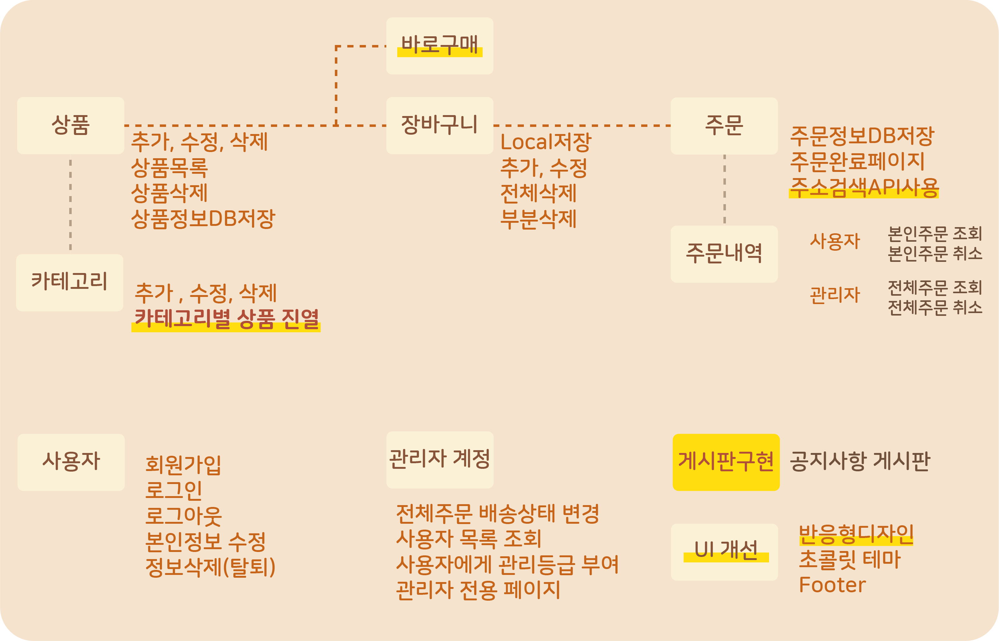

# 이상한 나라의 초콜릿 프로젝트
초콜릿제품을 전문적으로 판매하는 쇼핑몰을 구현였습니다. 2022.5.30 ~ 2022.6.10<br />

## 담당한 부분
백엔드 - 사용자, 주문 

## 🍪 Tech stacks & Tools

 <br />


 <br />


<br />

## 🍰Developers
박소정 , 백광천 , 반유진 , 이수정 , 주현정

## 🍫structure chart



---

## 폴더 구조
- 프론트: `src/views` 폴더 
- 백: `src/views` 이외 폴더 전체
- 실행: **프론트, 백 동시에, express로 실행**


## 설치 방법

1. **.env 파일 설정 (MONGODB_URL 환경변수를, 개인 로컬 혹은 Atlas 서버 URL로 설정해야 함)**

2. express 실행

```bash
# npm 을 쓰는 경우 
npm install
npm run start

# yarn 을 쓰는 경우
yarn
yarn start
```
<br>

---
본 프로젝트에서 제공하는 모든 코드 등의는 저작권법에 의해 보호받는 ㈜엘리스의 자산이며, 무단 사용 및 도용, 복제 및 배포를 금합니다.
Copyright 2022 엘리스 Inc. All rights reserved.
